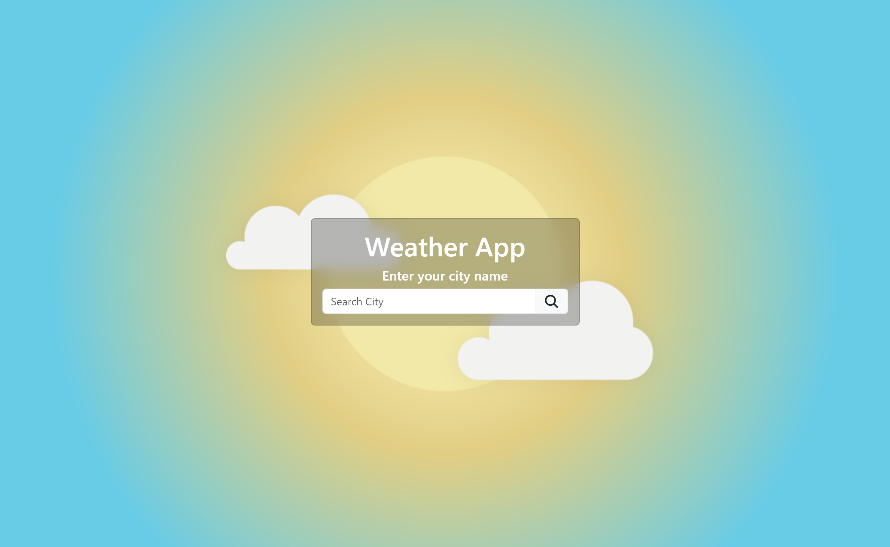
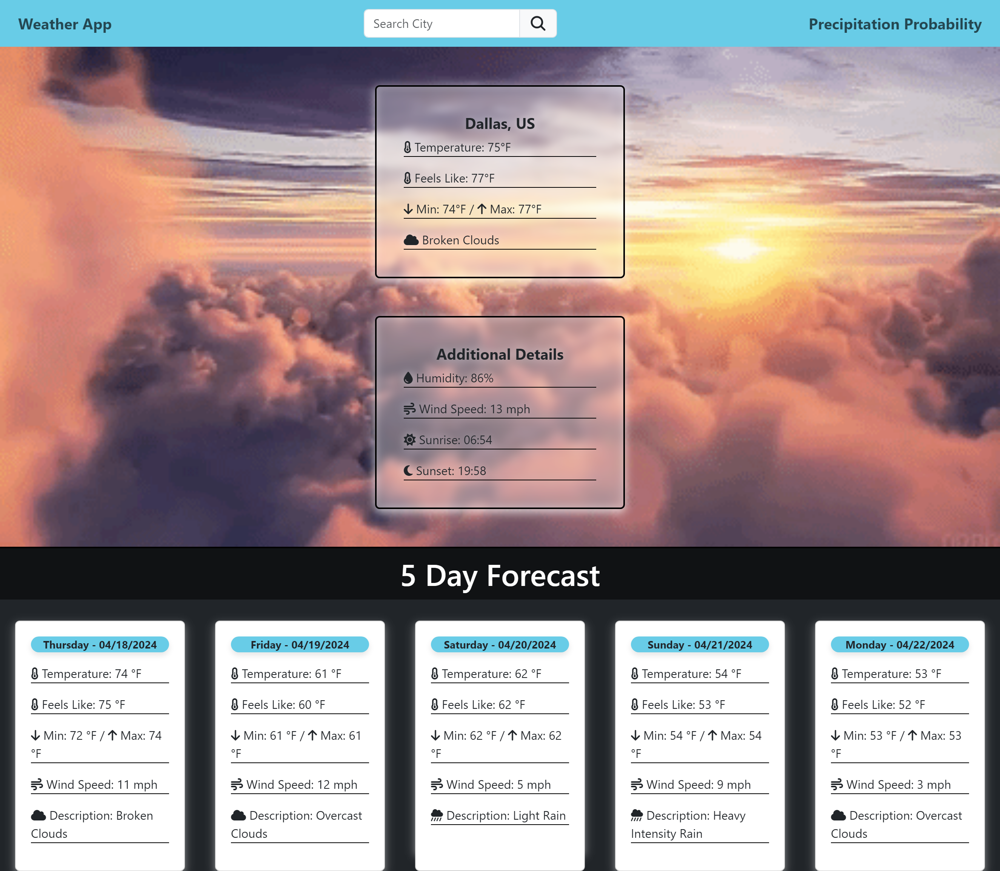

# Precipitation-Probability

## Weather App

This Weather App allows users to search for the weather forecast of a specific city. It provides both the current weather conditions and a 5-day forecast.

## Features

- **Search by City Name**: Users can enter the name of a city to get the current weather and 5-day forecast.
- **Autocomplete**: The search input field provides autocomplete suggestions based on the input city name.
- **Recent Searches**: Recent searches are saved and displayed when the search input field is clicked, allowing users to quickly revisit previous searches.
- **Error Handling**: Error messages are displayed for invalid input or network errors.
- **Responsive Design**: The app is designed to work on various screen sizes, from desktop to mobile devices.

## How to Use

1. **Search for City**: Enter the name of the city you want to check the weather for in the search input field.
2. **Autocomplete Suggestions**: As you type, the app will provide autocomplete suggestions based on your input.
3. **View Weather**: Once you've entered a valid city name, the app will display the current weather conditions and a 5-day forecast.
4. **Recent Searches**: Click on the search input field to view recent searches and quickly revisit previous searches.
5. **Error Handling**: If there's an error, such as an invalid city name or network issue, an error message will be displayed.

## Links

**Repository**: [GitHub Repo](https://github.com/joelamaya19/Precipitation-Probability)

**Website**: [Deployed Website](https://joelamaya19.github.io/Precipitation-Probability/)
